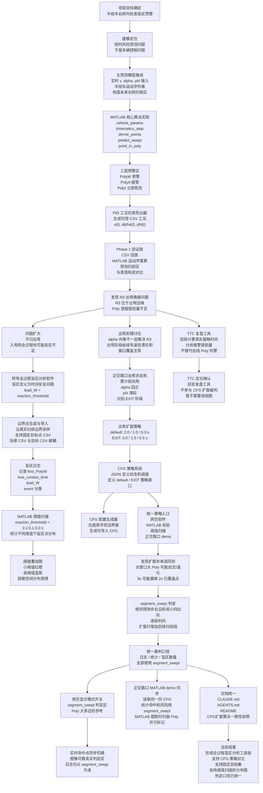

# 项目工作总结流程图

```mermaid
flowchart TD
    A["项目目标确定<br/>半挂车右转内轮差盲区预警"] --> B["建模定位<br/>短时风险预测问题<br/>不是车辆控制问题"]

    B --> C["主预测模型路线<br/>实时 v, alpha, phi 输入<br/>半挂车运动学外推<br/>构造未来右侧扫掠区"]
    C --> D["MATLAB 核心算法实现<br/>vehicle_params<br/>kinematics_step<br/>derive_points<br/>predict_swept<br/>point_in_poly"]
    D --> E["三层预警区<br/>PolyW 预警<br/>PolyA 报警<br/>PolyI 立即危险"]

    E --> F["PID 工况仿真导出器<br/>生成可控 CSV 工况<br/>v(t), alpha(t), phi(t)"]
    F --> G["Phase 1 验证链<br/>CSV 回放<br/>MATLAB 运动学重算<br/>预测扫掠区<br/>与真值轨迹对比"]

    G --> H["发现 R3 出弯晚报问题<br/>R3 位于出弯边缘<br/>Poly 首报提前量不足"]
    H --> I["TTC 复盘工具<br/>后验计算真实接触时间<br/>分析报警提前量<br/>不替代在线 Poly 判警"]

    H --> J["出弯机理讨论<br/>alpha 外推不一定解决 R3<br/>出弯阶段由挂车姿态滞后和窗口覆盖主导"]
    J --> K["正交路口出弯状态机<br/>累计航向角<br/>alpha 回正<br/>phi 滞后<br/>识别 EXIT 阶段"]
    K --> L["出弯扩窗策略<br/>default: 2.0 / 1.0 / 0.3 s<br/>EXIT: 3.0 / 1.5 / 0.5 s"]

    H --> M["问题扩大<br/>不只出弯<br/>入弯和全过程也可能反应不足"]
    M --> N["转弯全过程盲区分析软件<br/>盲区定义为时间安全问题<br/>lead_W < reaction_threshold"]
    N --> O["边界点生成与导入<br/>沿真实扫掠边界采样<br/>支持固定目标点 CSV<br/>场景 CSV 与目标 CSV 解耦"]
    O --> P["盲区日志<br/>记录 first_PolyW<br/>true_contact_time<br/>lead_W<br/>event 分类"]

    P --> Q["MATLAB 阈值扫描<br/>reaction_threshold = 0.1:0.1:3.0 s<br/>统计不同阈值下盲区点分布"]
    Q --> R["阈值叠加图<br/>小阈值红橙<br/>高阈值蓝紫<br/>观察空间分布规律"]

    L --> S["CFG 策略系统<br/>JSON 定义状态机阈值<br/>定义 default / EXIT 策略窗口"]
    S --> T["CFG 配置生成器<br/>白底黑字简洁界面<br/>生成可导入 CFG"]
    S --> U["统一策略入口<br/>网页软件<br/>MATLAB 校验<br/>阈值扫描<br/>正交路口 demo"]

    U --> V["发现扩窗非单调风险<br/>长窗口大 Poly 可能自交/退化<br/>3s 可能漏掉 2s 已覆盖点"]
    V --> W["segment_swept 判定<br/>相邻预测步右沿形成小四边形<br/>逐段判内<br/>扩窗只增加后续扫掠段"]
    W --> X["统一裁判口径<br/>日志 / 统计 / 盲区数量<br/>全部使用 segment_swept"]

    X --> Y["网页显示模式开关<br/>segment_swept 判定区<br/>Poly 大多边形参考"]
    Y --> Z["实时命中点同步切换<br/>图像可看真实判定区<br/>日志仍以 segment_swept 为准"]

    X --> AA["正交路口 MATLAB demo 同步<br/>读取同一份 CFG<br/>统计命中和风险用 segment_swept<br/>MATLAB 图暂时仍画 Poly 并已标记"]

    I --> AB["TTC 定位确认<br/>后验复盘工具<br/>不参与 CFG 扩窗裁判<br/>暂不需要改绘图"]

    X --> AC["文档统一<br/>CLAUDE.md<br/>AGENTS.md<br/>README<br/>CFG扩窗算法一致性说明"]
    AC --> AD["当前成果<br/>形成全过程盲区分析工具链<br/>支持 CFG 策略对比<br/>支持固定目标集<br/>支持阈值扫描和分布图<br/>判定口径已统一"]
```

## 汇报用一句话总结

本项目已经从“能预测半挂车右转扫掠区”推进到“能用统一 CFG 策略和 segment_swept 裁判，系统评估右转全过程中报警提前量不足的盲区点分布”。
